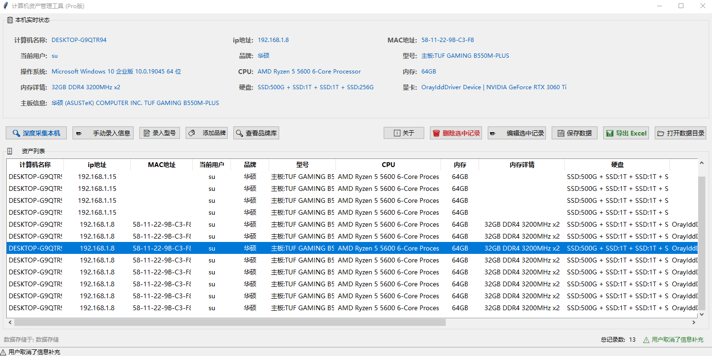

  
# 💻 Computer-Asset-Management Pro
> **基于 Python 的高效率企业级硬件资产自动采集与管理系统**  
> *A fast hardware asset collection & management tool for Windows*

[](https://www.python.org/)
[](LICENSE)
[](https://www.microsoft.com/windows)


## 📖 项目背景
在日常运维工作中，手动登记员工电脑配置不仅耗时耗力，还极易产生人为录入错误。本项目通过底层 API 自动抓取硬件指纹，并结合 **智能化品牌识别算法**，将单台设备的盘点时间从 5 分钟压缩至 **10 秒以内**，实现资产管理的自动化与标准化。

## ✨ 核心功能
- **🚀 异步深度采集**：利用多线程（Threading）技术，程序启动即秒开，后台自动完成 CPU、内存、硬盘、主板等核心硬件信息的静默扫描。
- **🏷️ 智能品牌引擎**：内置模糊匹配算法，能够从杂乱的 OEM 原始字符串中精准识别品牌（如将 `TUF GAMING B550M` 自动归类为 `华硕`）。
- **📥 引导式信息补充**：采集完成后自动弹出交互框，引导运维人员补充部门、使用人等关键归档信息。
- **💾 数据双保险机制**：
  - **实时持久化**：采用 JSON 格式进行本地数据库存储，支持断电/异常退出数据保护。
  - **一键导出**：集成 Pandas 引擎，支持将资产列表一键生成标准的 Excel 报表。
- **🛡️ 退出安全防护**：拦截窗口关闭协议，确保所有变更在关闭前均已获得保存确认。

## 📸 界面预览



##  怎么用？三步搞定
    1.打开软件，点“深度采集”
    软件开始静默扫描，你可以在列表里看到之前已经扫过的电脑（如果有的话）。
    
    2.自动弹窗，填部门和人员
    扫完立刻弹窗，你输入“张三”“财务部”，点确定，数据就加进去了。
    
    3.导出 Excel
    全部填完后，点“导出 Excel”，一张漂漂亮亮的资产表就生成了，直接交差。

## 🛠️ 技术栈
- **核心框架**: Python 3.11
- **图形界面**: Tkinter (自定义样式美化)
- **底层驱动**: WMI, pywin32 (Windows 管理工具)
- **数据处理**: Pandas, openpyxl, JSON
- **打包工具**: Nuitka

## 📦 快速开始

### 1. 环境准备
确保你的系统为 **Windows 10/11** 且已安装 **Python 3.8+**。

### 2. 安装依赖
```bash
git clone [https://github.com/SUIY1/Computer-Asset-Management.git](https://github.com/SUIY1/Computer-Asset-Management.git)
cd Computer-Asset-Management
pip install -r requirements.txt
```


### 3.运行程序
```bash
python main.py
```
### 4.打包EXE命令（可选）
```bash
打包命令:python -m nuitka --standalone --onefile --windows-disable-console --enable-plugin=tk-inter --nofollow-import-to=pydantic --output-dir=dist main.py
压缩软件:upx --best main.exe
```


## 📂 项目结构
```text
├── main.py                # 程序启动入口
├── gui.py                 # 界面布局与多线程交互逻辑
├── collector.py           # 硬件采集底层模块
├── data_handler.py        # Excel导出与JSON读写处理
├── brand_database.py      # 品牌匹配算法与数据库管理
├── requirements.txt       # 项目依赖包列表
└── 数据存储/               # 自动生成的数据存放目录
    ├── brands.json        # 品牌特征库
    └── computer_assets.json # 资产历史记录
```


---

## 🌍 English Overview

### Project Description (EN)
A Python-based hardware asset collection and management tool for Windows. It automatically captures CPU, memory, disk, mainboard, GPU, IP/MAC, and other hardware info, with smart brand recognition and one-click Excel export.

### Core Features (EN)
- **🚀 Deep hardware scan**: Background scan of CPU, memory (with DDR generation & frequency), disks (type + size + brand/model), mainboard, GPU, etc.
- **🌐 Network fingerprint**: Detects primary active NIC, collects **all IPv4 addresses + MAC address** on that interface.
- **🏷️ Smart brand engine**: Extensible brand database + fuzzy matching to identify brands from OEM strings.
- **📥 Guided input**: Auto-prompt for department/user after scan; manual input form pre-fills hardware data.
- **🗂 Editable asset table**: Double-click or right-click to edit/delete any record; toolbar buttons provided.
- **💾 JSON storage + Excel export**: One-click export with full columns (hostname, IP, MAC, CPU, memory, disk, GPU, mainboard, OS, department, user, timestamp…).
- **🧠 Brand library**: Add brands/models via GUI; view all brands in a popup.
- **🛡️ Safe exit**: Prompts to save before closing.

### Quick Start (EN)
1. **Environment**: Windows 10/11, Python 3.8+  
2. **Install**:
   ```bash
   git clone https://github.com/SUIY1/Computer-Asset-Management.git
   cd Computer-Asset-Management
   pip install -r requirements.txt
   ```
3. **Run**: `python main.py`  
4. **Build EXE** *(optional)*: See Chinese section above for Nuitka command.

---

## 📝 开发者感悟
“代码是冷的，但解决问题的成就感是热的。” 
—— 本项目由 SUI缘儿科技 倾力打造，旨在为广大基层 IT 运维工程师提供一个真正好用的开源工具。

## 🤝 贡献与支持
如果你在使用过程中发现了 Bug 或有更好的功能建议，欢迎提交 Issue 或 Pull Request！
如果你觉得这个工具有帮到你，请给一个 Star ⭐，这是对我最大的鼓励。

© 2026 SUI缘儿科技 | [个人公众号：SUI缘儿科技]


